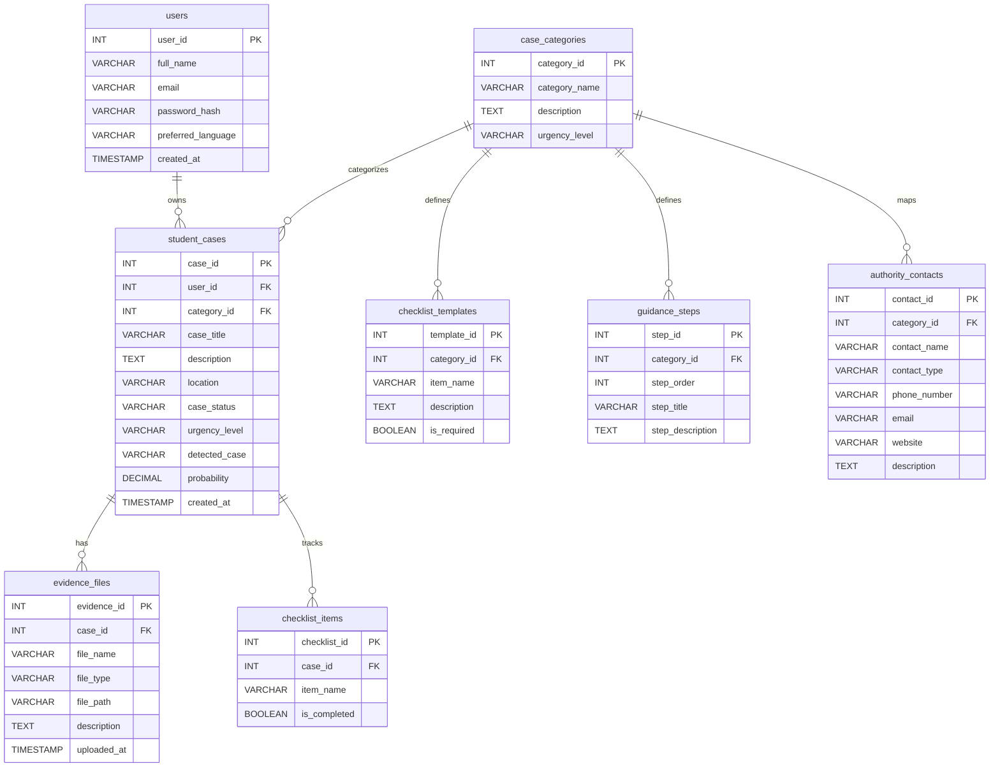

# SafeStay ERD

The following ERD is derived from [database.sql](database.sql) and includes only existing tables.

```mermaid
erDiagram
    users {
        INT user_id PK
        VARCHAR full_name
        VARCHAR email
        VARCHAR password_hash
        VARCHAR preferred_language
        TIMESTAMP created_at
    }

    case_categories {
        INT category_id PK
        VARCHAR category_name
        TEXT description
        VARCHAR urgency_level
    }

    student_cases {
        INT case_id PK
        INT user_id FK
        INT category_id FK
        VARCHAR case_title
        TEXT description
        VARCHAR location
        VARCHAR case_status
        VARCHAR urgency_level
        VARCHAR detected_case
        DECIMAL probability
        TIMESTAMP created_at
    }

    evidence_files {
        INT evidence_id PK
        INT case_id FK
        VARCHAR file_name
        VARCHAR file_type
        VARCHAR file_path
        TEXT description
        TIMESTAMP uploaded_at
    }

    checklist_items {
        INT checklist_id PK
        INT case_id FK
        VARCHAR item_name
        BOOLEAN is_completed
    }

    checklist_templates {
        INT template_id PK
        INT category_id FK
        VARCHAR item_name
        TEXT description
        BOOLEAN is_required
    }

    guidance_steps {
        INT step_id PK
        INT category_id FK
        INT step_order
        VARCHAR step_title
        TEXT step_description
    }

    authority_contacts {
        INT contact_id PK
        INT category_id FK
        VARCHAR contact_name
        VARCHAR contact_type
        VARCHAR phone_number
        VARCHAR email
        VARCHAR website
        TEXT description
    }

    users ||--o{ student_cases : owns
    case_categories ||--o{ student_cases : categorizes
    case_categories ||--o{ checklist_templates : defines
    case_categories ||--o{ guidance_steps : defines
    case_categories ||--o{ authority_contacts : maps
    student_cases ||--o{ evidence_files : has
    student_cases ||--o{ checklist_items : tracks
```